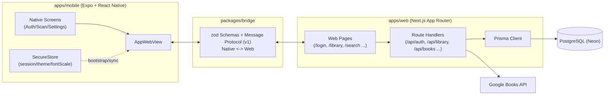

# BookLog Monorepo

BookLog는 웹(`apps/web`)과 모바일(`apps/mobile`)을 함께 개발하는 `pnpm workspaces` 기반 모노레포입니다.  
모바일 앱은 핵심 화면을 네이티브로 제공하고, 서재 경험은 WebView + 웹 앱과 타입 안전 브릿지(`packages/bridge`)로 동기화합니다.

## 현재 구현 상태

- 이메일/비밀번호 기반 인증(`signup`, `login`, `logout`)
- 개인 서재 CRUD(책 추가/조회/상태 변경/삭제)
- 책별 노트 CRUD
- Google Books 기반 검색/ISBN 조회 + 외부 API 오류 상태 처리
- 모바일 바코드 스캔(EAN-13 ISBN), 수동 검색 진입
- 모바일-웹 간 인증/테마/폰트 스케일 동기화 브릿지(v1)

## 모노레포 구성

```text
.
├─ apps
│  ├─ web        # Next.js App Router + Prisma + API Routes
│  └─ mobile     # Expo(Dev Client) + React Navigation + WebView
├─ packages
│  └─ bridge     # RN <-> WebView 메시지 스키마/유틸/테스트
├─ docs
│  ├─ architecture.md
│  └─ error-states.md
└─ ...
```

## 상위 아키텍처 다이어그램



## 기술 스택

- Web: Next.js(App Router), React, Tailwind CSS, shadcn/ui
- Mobile: Expo, React Native, React Navigation, `react-native-webview`, `expo-camera`
- Backend: Next.js Route Handlers, Prisma, PostgreSQL(Neon)
- Auth/Security: argon2, JWT 세션, HttpOnly 쿠키
- Validation/Contracts: zod, `@booklog/bridge`
- Tooling: TypeScript(strict), ESLint, Vitest, pnpm

## 시작하기

### 1) 사전 준비

- Node.js 20+
- pnpm (Corepack 권장)
- iOS: Xcode + Command Line Tools
- Android: Android Studio + SDK

```bash
corepack enable
corepack prepare pnpm@latest --activate
```

### 2) 환경변수 설정

```bash
cp .env.example .env.local
```

루트 `.env.local` 필수/선택 키:

- 필수
  - `DATABASE_URL`
  - `SESSION_JWT_SECRET`
  - `NEXT_PUBLIC_APP_URL` (기본 `http://localhost:3000`)
- 선택
  - `UPSTASH_REDIS_REST_URL`
  - `UPSTASH_REDIS_REST_TOKEN`
  - `GOOGLE_BOOKS_API_KEY`

### 3) 의존성 설치

```bash
pnpm install
```

### 4) 개발 서버 실행

```bash
pnpm dev:web
pnpm dev:mobile
```

### 5) 모바일 로컬 실행

```bash
pnpm --filter @booklog/mobile ios
pnpm --filter @booklog/mobile android
```

## 데이터베이스(Prisma)

`apps/web` 기준 Prisma 스키마/마이그레이션을 사용합니다.

- `pnpm --filter @booklog/web db:migrate`
- `pnpm --filter @booklog/web db:studio`
- `pnpm --filter @booklog/web db:seed`
- `pnpm --filter @booklog/web db:reset`

루트의 `pnpm db:migrate`는 아직 자리표시자 명령입니다.

## 주요 스크립트

- 루트
  - `pnpm dev:web`
  - `pnpm dev:mobile`
  - `pnpm lint`
  - `pnpm typecheck`
  - `pnpm test`
  - `pnpm build:web:vercel`
- 패키지
  - `pnpm --filter @booklog/bridge test`
  - `pnpm --filter @booklog/web build`

## 브릿지 프로토콜(`packages/bridge`)

- 버전: `v: 1`
- Native -> Web: `SET_AUTH`, `CLEAR_AUTH`, `SET_THEME`, `SET_FONT_SCALE`, `NAVIGATE`, `PING`, `PONG`
- Web -> Native: `READY`, `REQUEST_LOGOUT`, `OPEN_NATIVE_SCREEN`, `OPEN_EXTERNAL`, `HAPTIC`, `LOG`, `PING`, `PONG`
- WebView 초기 로드 전 `__BOOKLOG_BOOTSTRAP__` 주입으로 초기 인증/테마/폰트 상태 동기화
- 모든 메시지는 zod 기반 스키마로 파싱/검증

## 웹 앱 라우트 개요

- 페이지: `/login`, `/signup`, `/home`, `/search`, `/books/add`, `/library`, `/library/[bookId]`, `/logout`
- API: `/api/auth/*`, `/api/books/search`, `/api/books/isbn/[isbn]`, `/api/library/*`, `/api/notes/[id]`

## 트러블슈팅

- WebView 쿠키 동기화가 안 될 때  
  세션 쿠키 Domain/HTTPS/Secure 설정 확인
- iOS에서 폰트 스케일 반영이 느릴 때  
  접근성 텍스트 크기 변경 후 앱 포그라운드 복귀

## 참고 문서

- [Architecture](docs/architecture.md)
- [External API Error States](docs/error-states.md)
