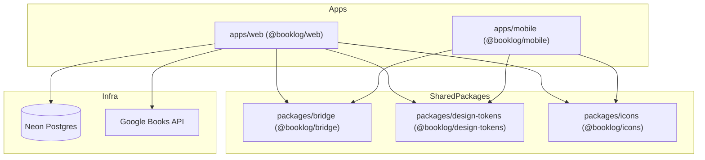
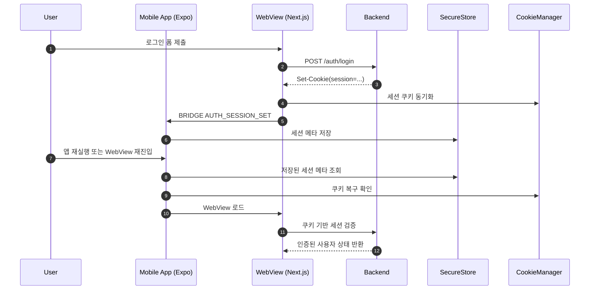
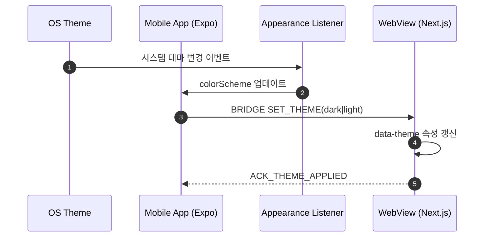

# Architecture

## 0) 모노레포 의존성 그래프

```mermaid
flowchart TD
  subgraph Apps
    WEB["apps/web (@booklog/web)"]
    MOBILE["apps/mobile (@booklog/mobile)"]
  end

  subgraph SharedPackages
    BRIDGE["packages/bridge (@booklog/bridge)"]
    TOKENS["packages/design-tokens (@booklog/design-tokens)"]
    ICONS["packages/icons (@booklog/icons)"]
  end

  subgraph Infra
    DB[("Neon Postgres")]
    GBOOKS["Google Books API"]
  end

  WEB --> BRIDGE
  WEB --> TOKENS
  WEB --> ICONS
  MOBILE --> BRIDGE
  MOBILE --> TOKENS
  MOBILE --> ICONS
  WEB --> DB
  WEB --> GBOOKS
```

## 1) 로그인/세션 재진입 플로우

```mermaid
sequenceDiagram
  autonumber
  participant U as User
  participant M as Mobile App (Expo)
  participant W as WebView (Next.js)
  participant B as Backend
  participant SS as SecureStore
  participant CM as CookieManager

  U->>W: 로그인 폼 제출
  W->>B: POST /auth/login
  B-->>W: Set-Cookie(session=...)
  W->>CM: 세션 쿠키 동기화
  W->>M: BRIDGE AUTH_SESSION_SET
  M->>SS: 세션 메타 저장
  U->>M: 앱 재실행 또는 WebView 재진입
  M->>SS: 저장된 세션 메타 조회
  M->>CM: 쿠키 복구 확인
  M->>W: WebView 로드
  W->>B: 쿠키 기반 세션 검증
  B-->>W: 인증된 사용자 상태 반환
```

## 2) 다크모드 동기화 플로우

```mermaid
sequenceDiagram
  autonumber
  participant OS as OS Theme
  participant M as Mobile App (Expo)
  participant A as Appearance Listener
  participant W as WebView (Next.js)

  OS->>A: 시스템 테마 변경 이벤트
  A->>M: colorScheme 업데이트
  M->>W: BRIDGE SET_THEME(dark|light)
  W->>W: data-theme 속성 갱신
  W-->>M: ACK_THEME_APPLIED
```
