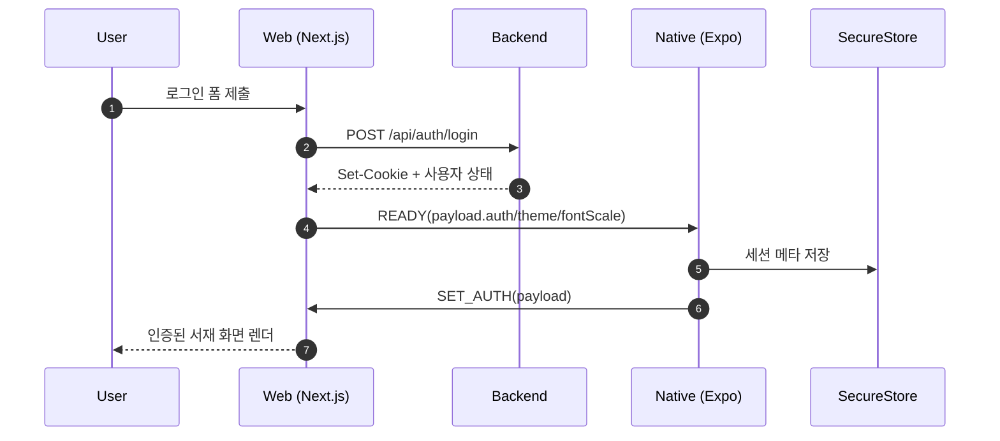
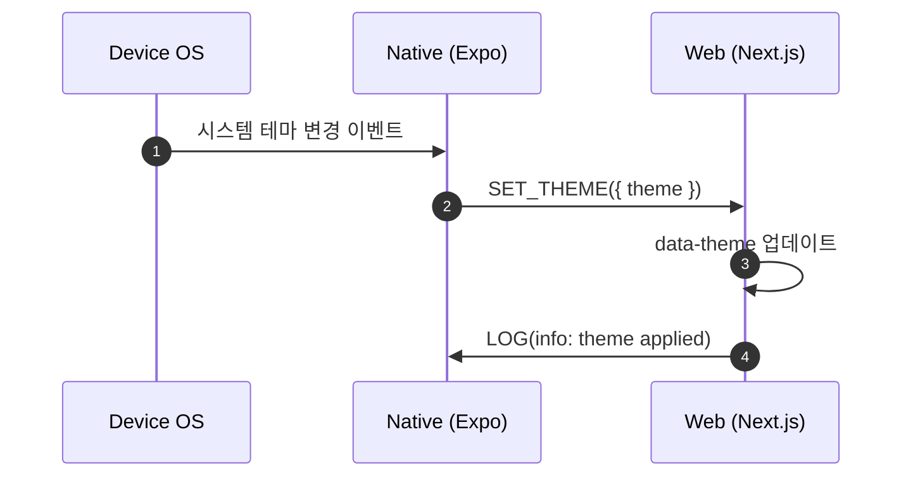

# `@booklog/bridge`

`@booklog/bridge`는 React Native(WebView host)와 Next.js(WebView content) 사이의 타입 안전한 메시지 프로토콜 패키지입니다.

- 프로토콜 버전: `v: 1`
- 검증 방식: 모든 메시지를 `zod` discriminated union으로 파싱
- 원칙: 파싱 실패/알 수 없는 메시지는 로그만 남기고 앱 크래시를 피함

## 메시지 카탈로그

| type | direction | payload | 설명 |
| --- | --- | --- | --- |
| `SET_AUTH` | Native -> Web | `AuthPayload` | 인증 토큰/유저 식별자를 웹에 동기화 |
| `CLEAR_AUTH` | Native -> Web | 없음 | 웹 인증 상태 초기화 |
| `SET_THEME` | Native -> Web | `ThemePayload` | 웹 테마(light/dark/system) 반영 |
| `SET_FONT_SCALE` | Native -> Web | `FontScalePayload` | 접근성 폰트 배율 동기화 |
| `NAVIGATE` | Native -> Web | `NavigatePayload` | 웹 내부 경로 이동 지시 |
| `READY` | Web -> Native | `BootstrapPayload` | 웹 초기화 완료 및 bootstrap 상태 전달 |
| `REQUEST_LOGOUT` | Web -> Native | 없음 | 네이티브 로그아웃 처리 요청 |
| `OPEN_NATIVE_SCREEN` | Web -> Native | `OpenNativeScreenPayload` | 특정 네이티브 화면 오픈 |
| `OPEN_EXTERNAL` | Web -> Native | `OpenExternalPayload` | 외부 URL 오픈 요청 |
| `HAPTIC` | Web -> Native | `HapticPayload` | 네이티브 햅틱 피드백 요청 |
| `LOG` | Web -> Native | `LogPayload` | 웹 로그를 네이티브로 전달 |
| `PING` | 양방향 | `PingPayload` | 브릿지 연결 헬스체크 요청 |
| `PONG` | 양방향 | `PongPayload` | 헬스체크 응답 |

## 새 메시지 추가 체크리스트(3단계)

1. `src/schema.ts`에 payload 스키마와 union 항목을 추가하고 `v`/`type` 규칙을 유지한다.
2. `src/native.ts` 또는 `src/web.ts` 수신 핸들러 분기를 추가하고, 잘못된 입력 시 no-crash 로그 경로를 보장한다.
3. 테스트(`src/*.test.ts`)와 이 README의 메시지 카탈로그를 함께 갱신한 뒤 `pnpm --filter @booklog/bridge test`로 검증한다.

## 시퀀스 다이어그램

### 로그인 플로우

### 테마 변경 플로우

